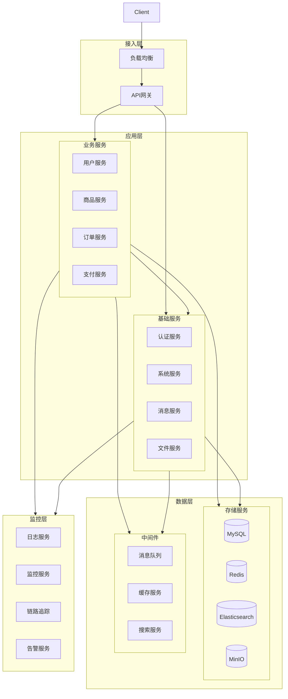
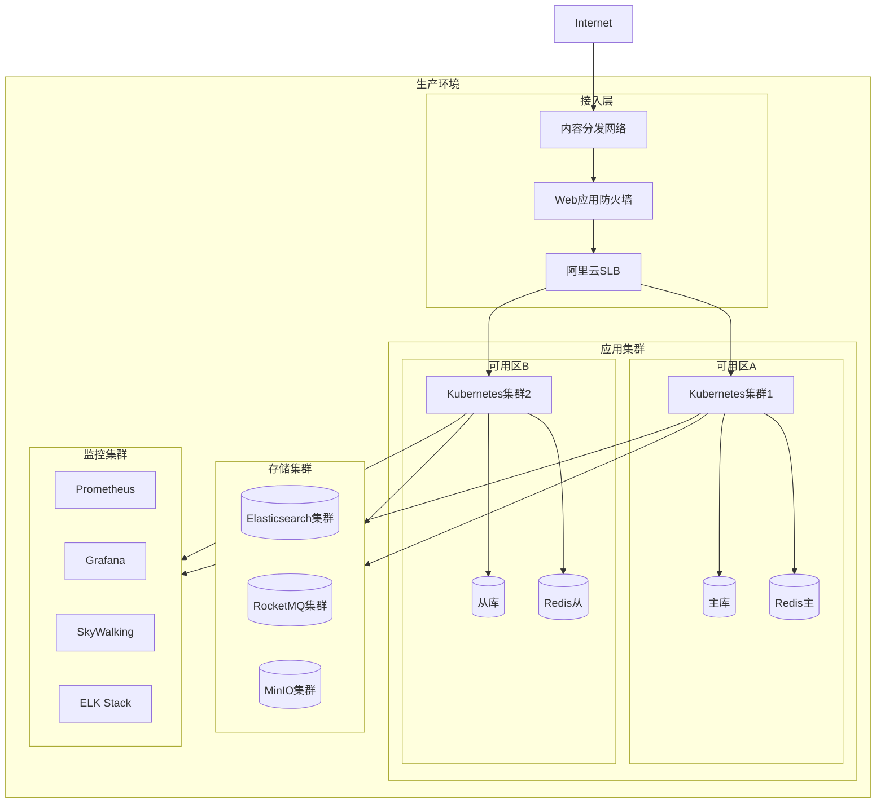

# 系统架构文档

## 1. 系统概述

### 1.1 系统简介
商城系统是一个基于微服务架构的分布式电商平台，采用前后端分离的开发模式，提供商品管理、订单管理、用户管理、支付管理等核心功能。

### 1.2 系统目标
1. 高可用性：系统7*24小时稳定运行，支持故障自动转移
2. 高并发：支持百万级用户同时在线，秒级响应
3. 可扩展：支持业务快速扩展，系统水平扩展
4. 安全性：保障用户数据安全，系统运行安全
5. 可维护：系统易于维护，问题快速定位

### 1.3 系统范围
1. 用户端
   - 商品浏览和搜索
   - 购物车管理
   - 订单管理
   - 支付管理
   - 用户中心
2. 管理端
   - 商品管理
   - 订单管理
   - 用户管理
   - 支付管理
   - 系统管理

## 2. 系统架构

### 2.1 整体架构

### 2.2 技术架构
1. 开发语言
   - 后端：Java 17
   - 前端：TypeScript + Vue 3
   - 移动端：Flutter

2. 框架选型
   - 微服务框架：Spring Cloud Alibaba
   - 服务注册与发现：Nacos
   - 配置中心：Nacos
   - 网关：Spring Cloud Gateway
   - 认证授权：Spring Security + OAuth2
   - 数据库：MySQL 8.0
   - 缓存：Redis 7.0
   - 消息队列：RocketMQ
   - 搜索引擎：Elasticsearch 8.x
   - 对象存储：MinIO
   - 服务监控：Prometheus + Grafana
   - 链路追踪：SkyWalking
   - 日志管理：ELK Stack

3. 开发工具
   - IDE：IntelliJ IDEA
   - 构建工具：Maven
   - 版本控制：Git
   - 容器化：Docker
   - 编排工具：Kubernetes
   - CI/CD：Jenkins

### 2.3 部署架构

## 3. 微服务拆分

### 3.1 服务划分
1. 业务服务
   - 用户服务 (user-service)
     - 用户管理
     - 会员管理
     - 地址管理
   - 商品服务 (product-service)
     - 商品管理
     - 分类管理
     - 品牌管理
     - 库存管理
   - 订单服务 (order-service)
     - 订单管理
     - 购物车管理
     - 优惠券管理
   - 支付服务 (payment-service)
     - 支付管理
     - 退款管理
     - 对账管理

2. 基础服务
   - 认证服务 (auth-service)
     - 用户认证
     - 权限管理
     - 令牌管理
   - 系统服务 (system-service)
     - 系统管理
     - 日志管理
     - 通知管理
   - 消息服务 (message-service)
     - 消息管理
     - 模板管理
     - 发送管理
   - 文件服务 (file-service)
     - 文件上传
     - 文件管理
     - 图片处理

### 3.2 服务通信
1. 同步通信
   - REST API：服务间HTTP调用
   - gRPC：高性能RPC调用
   - OpenFeign：声明式服务调用

2. 异步通信
   - 消息队列：RocketMQ
   - 事件驱动：Spring Cloud Stream
   - WebSocket：实时通信

### 3.3 服务治理
1. 服务注册与发现
   - 注册中心：Nacos
   - 服务健康检查
   - 服务元数据管理

2. 配置管理
   - 配置中心：Nacos
   - 配置版本控制
   - 配置动态刷新

3. 负载均衡
   - 客户端负载均衡：Spring Cloud LoadBalancer
   - 服务端负载均衡：Nginx
   - 会话保持
   - 权重路由

4. 服务熔断与降级
   - 熔断器：Sentinel
   - 降级策略
   - 限流规则
   - 系统保护

5. 服务监控
   - 服务健康检查
   - 性能指标监控
   - 调用链路追踪
   - 日志收集分析

## 4. 数据架构

### 4.1 数据存储
1. 关系型数据库
   - 主数据库：MySQL 8.0
   - 读写分离
   - 分库分表
   - 数据备份

2. 缓存数据库
   - 分布式缓存：Redis 7.0
   - 多级缓存
   - 缓存同步
   - 缓存监控

3. 搜索引擎
   - 全文检索：Elasticsearch 8.x
   - 数据同步
   - 索引管理
   - 搜索优化

4. 对象存储
   - 文件存储：MinIO
   - 图片处理
   - 文件管理
   - 访问控制

### 4.2 数据流转
1. 数据同步
   - 数据库同步：Canal
   - 缓存同步：消息队列
   - 搜索同步：Logstash
   - 文件同步：MinIO

2. 数据备份
   - 全量备份
   - 增量备份
   - 实时备份
   - 备份验证

3. 数据安全
   - 数据加密
   - 访问控制
   - 审计日志
   - 数据脱敏

## 5. 安全架构

### 5.1 认证授权
1. 用户认证
   - 账号密码认证
   - 手机号认证
   - 第三方认证
   - 多因素认证

2. 权限控制
   - 角色权限
   - 数据权限
   - 接口权限
   - 操作权限

3. 安全防护
   - 防SQL注入
   - 防XSS攻击
   - 防CSRF攻击
   - 防重放攻击

### 5.2 数据安全
1. 传输安全
   - HTTPS加密
   - 数据签名
   - 时间戳验证
   - 防重放设计

2. 存储安全
   - 数据加密
   - 密码加盐
   - 敏感数据脱敏
   - 数据备份

3. 访问安全
   - 访问控制
   - 操作审计
   - 异常监控
   - 安全告警

## 6. 监控运维

### 6.1 系统监控
1. 服务监控
   - 服务健康检查
   - 性能指标监控
   - 资源使用监控
   - 业务指标监控

2. 链路追踪
   - 调用链路追踪
   - 性能分析
   - 异常定位
   - 依赖分析

3. 日志管理
   - 日志收集
   - 日志分析
   - 日志存储
   - 日志查询

### 6.2 运维管理
1. 部署管理
   - 容器化部署
   - 自动化部署
   - 灰度发布
   - 回滚机制

2. 配置管理
   - 环境配置
   - 应用配置
   - 配置版本
   - 配置审计

3. 告警管理
   - 告警规则
   - 告警通知
   - 告警升级
   - 告警处理

## 7. 更新记录

| 日期 | 版本 | 更新内容 | 更新人 |
|------|------|----------|--------|
| 2024-03-xx | v1.0.0 | 初始版本 | - | 