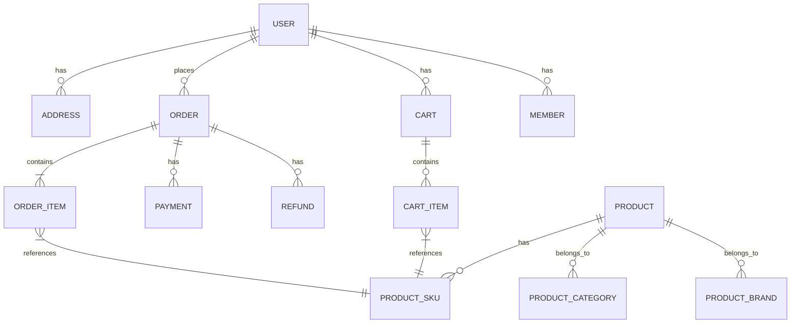
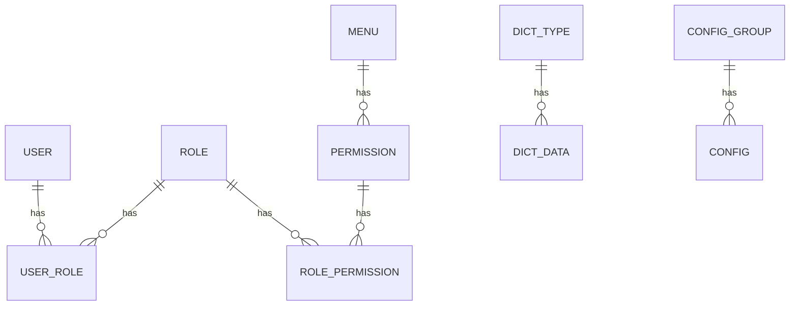

# 数据库设计文档

## 1. 数据库概述

### 1.1 数据库选型
- 主数据库：MySQL 8.0
- 缓存数据库：Redis 7.0
- 搜索引擎：Elasticsearch 8.x
- 对象存储：MinIO

### 1.2 数据库设计原则
1. 遵循三范式设计
2. 合理使用反范式优化
3. 适当冗余提高查询效率
4. 统一命名规范
5. 合理使用索引
6. 考虑分库分表扩展性

### 1.3 命名规范
1. 数据库名：mall_{service_name}
2. 表名：小写字母，下划线分隔
3. 字段名：小写字母，下划线分隔
4. 主键：id
5. 外键：{table_name}_id
6. 创建时间：created_at
7. 更新时间：updated_at
8. 删除标记：deleted_at

### 1.4 字段规范
1. 主键：bigint，自增
2. 创建时间：datetime
3. 更新时间：datetime
4. 删除时间：datetime
5. 状态字段：tinyint
6. 金额字段：decimal(10,2)
7. 编码字段：varchar(32)
8. 名称字段：varchar(64)
9. 描述字段：varchar(255)
10. 详情字段：text

### 1.5 索引规范
1. 主键索引：PRIMARY KEY
2. 唯一索引：UNIQUE KEY
3. 普通索引：KEY
4. 联合索引：KEY
5. 全文索引：FULLTEXT KEY

## 2. 数据库列表

### 2.1 业务数据库
1. mall_user：用户服务数据库
   - 用户信息
   - 会员信息
   - 地址信息
   - 积分记录

2. mall_product：商品服务数据库
   - 商品信息
   - 分类信息
   - 品牌信息
   - 规格信息
   - 库存信息

3. mall_order：订单服务数据库
   - 订单信息
   - 订单明细
   - 购物车信息
   - 优惠券信息

4. mall_payment：支付服务数据库
   - 支付信息
   - 退款信息
   - 交易流水
   - 对账信息

### 2.2 系统数据库
1. mall_system：系统服务数据库
   - 系统配置
   - 字典数据
   - 操作日志
   - 定时任务

2. mall_auth：认证服务数据库
   - 用户认证
   - 权限信息
   - 角色信息
   - 菜单信息

## 3. 数据库关系图

### 3.1 核心业务关系

### 3.2 系统管理关系

## 4. 分库分表策略

### 4.1 分库策略
1. 按业务领域分库
2. 读写分离
3. 主从复制

### 4.2 分表策略
1. 订单表：按用户ID分表
2. 支付表：按订单ID分表
3. 交易流水表：按时间分表
4. 操作日志表：按时间分表

## 5. 数据库维护

### 5.1 备份策略
1. 全量备份：每日凌晨
2. 增量备份：每小时
3. 实时备份：binlog
4. 备份文件保留：30天

### 5.2 监控策略
1. 性能监控
   - QPS
   - TPS
   - 响应时间
   - 连接数
   - 慢查询

2. 容量监控
   - 磁盘使用率
   - 表大小
   - 索引大小
   - 数据增长

3. 可用性监控
   - 主从延迟
   - 复制状态
   - 连接状态
   - 错误日志

## 6. 更新记录

| 日期 | 版本 | 更新内容 | 更新人 |
|------|------|----------|--------|
| 2024-03-xx | v1.0.0 | 初始版本 | - | 